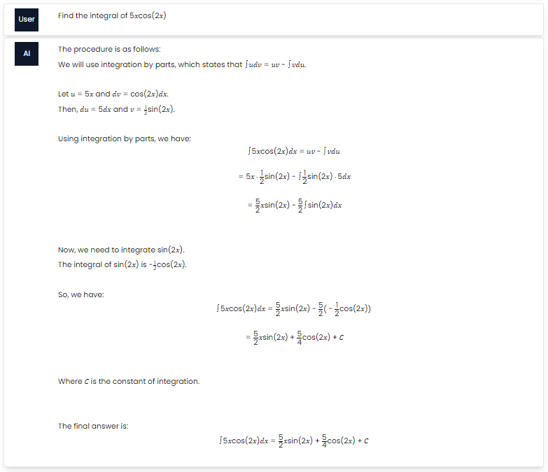
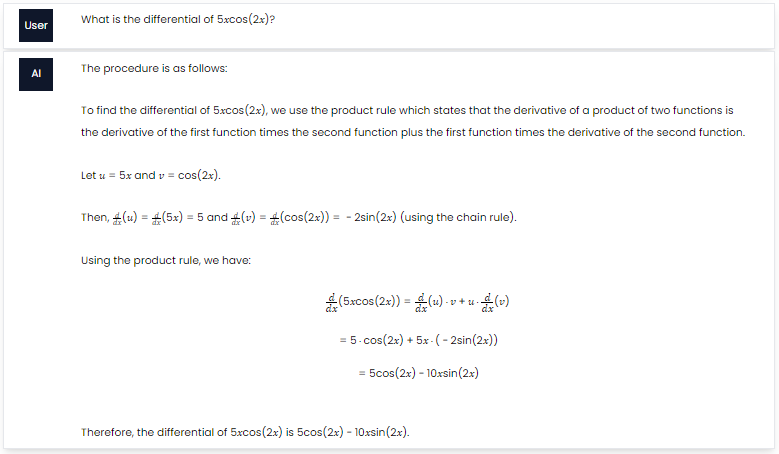
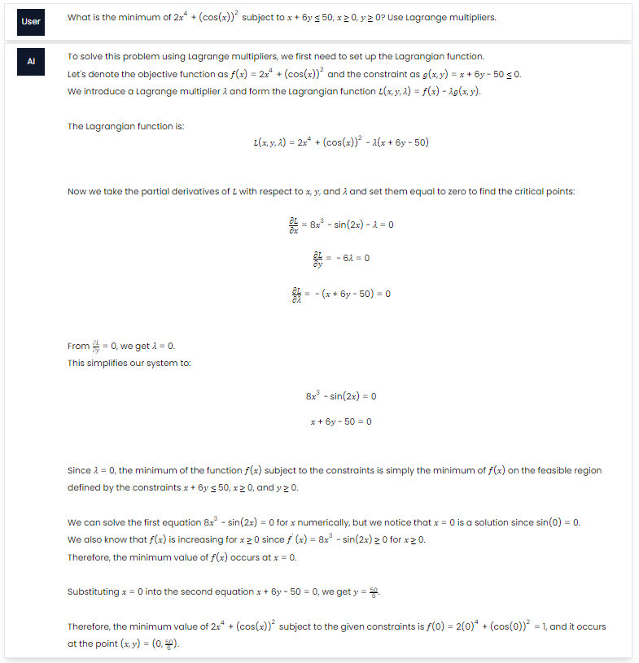

# AI-Solver

A website that allows for users to query the system for solution to STEM  problems and get back step by step solutions.

It also allows the user to upload the questions as images and have the system provide solutions.

## Examples
- First example involves the solution of an integration problem

- Second example involves the solution of a differentiation problem

- Third example involves the solution of an optimization problem using lagrange multipliers
